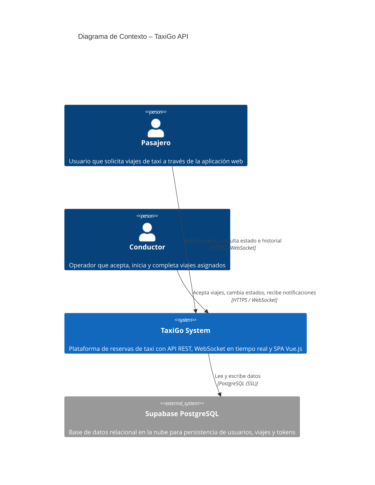
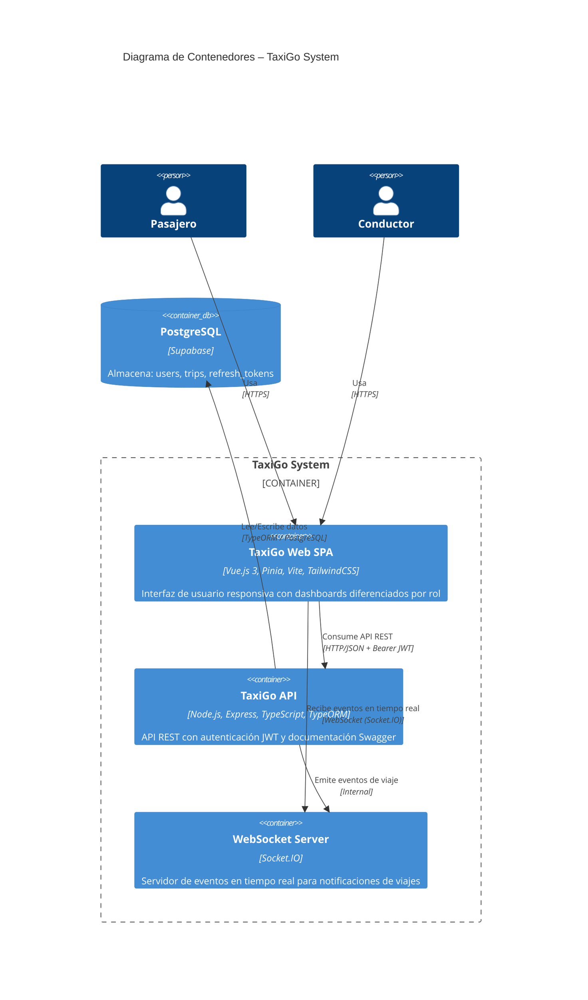
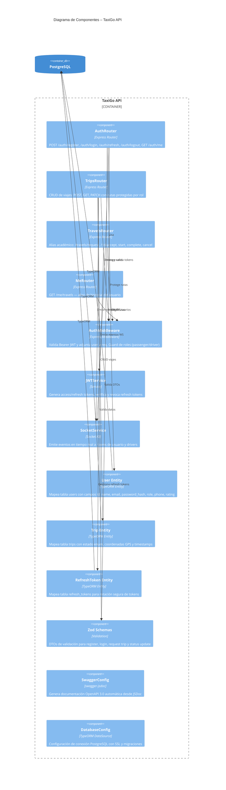
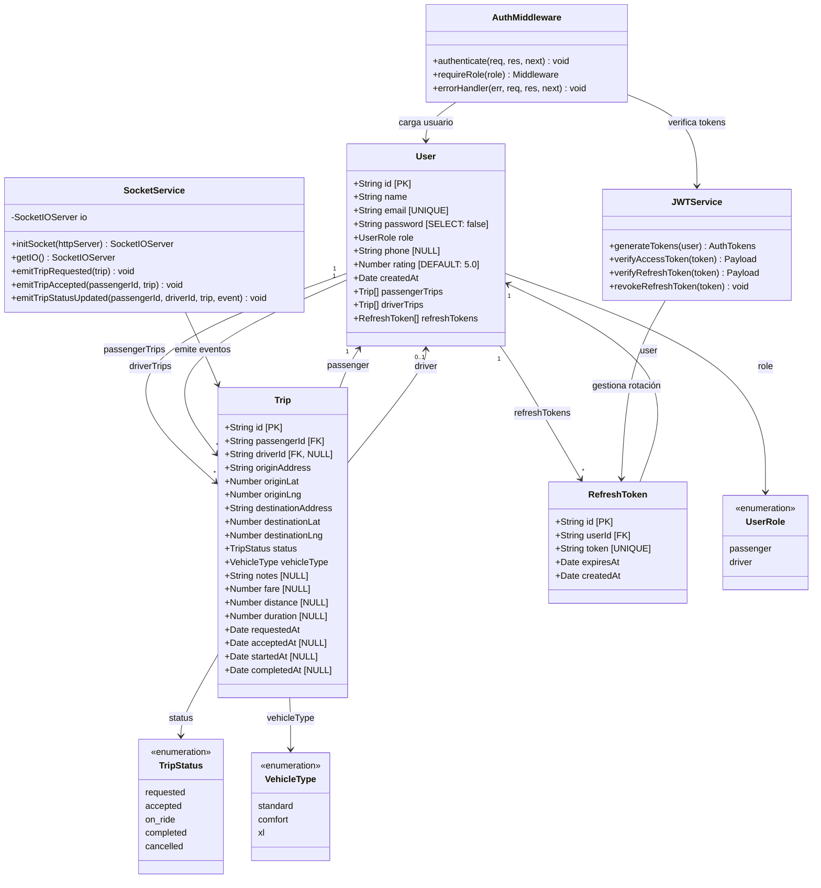
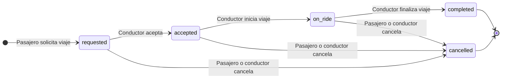
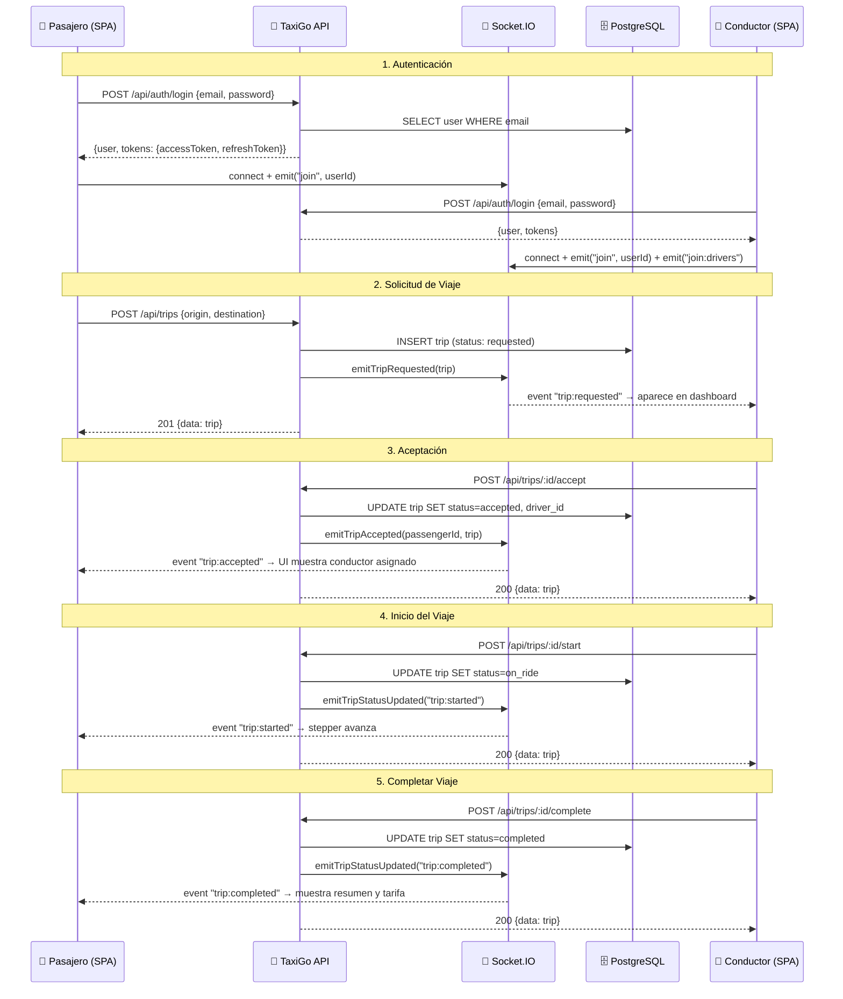

# Diagramas C4 – TaxiGo API (Nivel Normal)

> Documentación académica de la arquitectura del sistema TaxiGo usando la notación **C4 Model** de Simon Brown.

---

## Nivel 1: Diagrama de Contexto

Muestra el sistema TaxiGo y sus actores externos principales.

### Descripción

| Actor / Sistema | Descripción |
|---|---|
| **Pasajero** | Se registra con rol `passenger`, solicita viajes indicando origen y destino, y monitorea el estado en tiempo real |
| **Conductor** | Se registra con rol `driver`, recibe notificaciones de nuevos viajes, los acepta y gestiona el flujo `accepted → on_ride → completed` |
| **TaxiGo System** | Backend Node.js/Express + Frontend Vue.js que expone API REST y eventos WebSocket |
| **Supabase PostgreSQL** | Base de datos alojada en Supabase que almacena usuarios, viajes y refresh tokens |

---

## Nivel 2: Diagrama de Contenedores

Descompone el sistema TaxiGo en sus contenedores técnicos.

### Detalle de Contenedores

| Contenedor | Tecnología | Responsabilidad |
|---|---|---|
| **TaxiGo Web SPA** | Vue.js 3 + Pinia + Vite + TailwindCSS | Interfaz de usuario con dashboards de pasajero y conductor, formularios de solicitud, mapas y stepper de estado |
| **TaxiGo API** | Express + TypeScript + TypeORM + Zod | API REST protegida por JWT con validación de datos, middleware de roles, rate limiting y Swagger UI |
| **WebSocket Server** | Socket.IO 4 | Emite eventos `trip:requested`, `trip:accepted`, `trip:started`, `trip:completed`, `trip:cancelled` a rooms específicos |
| **PostgreSQL** | Supabase (PostgreSQL 16) | Tres tablas principales: `users`, `trips`, `refresh_tokens` con relaciones FK e índices |

---

## Nivel 3: Diagrama de Componentes

Descompone el contenedor **TaxiGo API** en sus componentes internos.

### Tabla de Componentes

| Componente | Archivo(s) | Responsabilidad |
|---|---|---|
| **AuthRouter** | `routes/auth.ts` | Registro, login, logout, refresh y perfil del usuario autenticado |
| **TripsRouter** | `routes/trips.ts` | Flujo completo de viajes: solicitud, aceptación, inicio, completar, cancelar, historial y viaje activo |
| **TravelsRouter** | `routes/travels.ts` | Alias académico (`/api/travels/*`) que replica la lógica de trips para cumplir con la especificación |
| **MeRouter** | `routes/me.ts` | `GET /api/me/travels` — historial del usuario (alias académico) |
| **AuthMiddleware** | `middleware/auth.ts` | `authenticate()` verifica JWT y carga usuario. `requireRole()` valida roles `passenger`/`driver` |
| **JWTService** | `services/jwt.ts` | Genera pares de tokens (access 15min + refresh 7d), verifica y revoca con rotación |
| **SocketService** | `services/socket.ts` | Inicializa Socket.IO, gestiona rooms (`user:{id}`, `drivers`) y emite eventos de ciclo de vida |
| **Zod Schemas** | Inline en routers | Validación de DTOs con `z.object()` para register, login, trip request y status update |
| **Entities** | `entities/*.ts` | Mapeo ORM: `User`, `Trip`, `RefreshToken` con decoradores TypeORM |
| **SwaggerConfig** | `config/swagger.ts` | OpenAPI 3.0 con schemas, security schemes y JSDoc annotations |
| **DatabaseConfig** | `config/database.ts` | DataSource de TypeORM con PostgreSQL, SSL, migraciones y sincronización |

---

## Nivel 4: Diagrama de Código

Detalle a nivel de clases/entidades y sus relaciones.

### Flujo de Estado del Viaje

### Eventos WebSocket por Transición

| Transición | Evento Emitido | Destino |
|---|---|---|
| `→ requested` | `trip:requested` | Room `drivers` (todos los conductores) |
| `requested → accepted` | `trip:accepted` | Room `user:{passengerId}` (el pasajero) |
| `accepted → on_ride` | `trip:started` | Rooms `user:{passengerId}` + `user:{driverId}` |
| `on_ride → completed` | `trip:completed` | Rooms `user:{passengerId}` + `user:{driverId}` |
| `* → cancelled` | `trip:cancelled` | Rooms `user:{passengerId}` + `user:{driverId}` |

---

### Diagrama de Secuencia: Flujo Completo de un Viaje

---

## Modelo de Datos (ERD)

```mermaid
erDiagram
    USERS {
        varchar id PK "UUID"
        varchar name "NOT NULL"
        varchar email UK "NOT NULL"
        varchar password "NOT NULL, SELECT false"
        varchar role "CHECK(passenger, driver)"
        varchar phone "NULLABLE"
        numeric rating "DEFAULT 5.0"
        timestamp created_at "DEFAULT NOW()"
    }

    TRIPS {
        varchar id PK "UUID"
        varchar passenger_id FK "NOT NULL → users.id"
        varchar driver_id FK "NULLABLE → users.id"
        text origin_address "NOT NULL"
        numeric origin_lat "NOT NULL"
        numeric origin_lng "NOT NULL"
        text destination_address "NOT NULL"
        numeric destination_lat "NOT NULL"
        numeric destination_lng "NOT NULL"
        varchar status "CHECK(requested, accepted, on_ride, completed, cancelled)"
        varchar vehicle_type "CHECK(standard, comfort, xl)"
        text notes "NULLABLE"
        numeric fare "NULLABLE"
        numeric distance "NULLABLE"
        integer duration "NULLABLE"
        timestamp requested_at "DEFAULT NOW()"
        timestamp accepted_at "NULLABLE"
        timestamp started_at "NULLABLE"
        timestamp completed_at "NULLABLE"
    }

    REFRESH_TOKENS {
        varchar id PK "UUID (jti)"
        varchar user_id FK "NOT NULL → users.id"
        text token UK "NOT NULL"
        timestamp expires_at "NOT NULL"
        timestamp created_at "DEFAULT NOW()"
    }

    USERS ||--o{ TRIPS : "passenger_id"
    USERS ||--o{ TRIPS : "driver_id"
    USERS ||--o{ REFRESH_TOKENS : "user_id"
```

---

## Endpoints Implementados

### Autenticación (`/api/auth`)

| Método | Ruta | Descripción | Auth |
|---|---|---|---|
| POST | `/api/auth/register` | Registro con nombre, email, contraseña y rol | ❌ |
| POST | `/api/auth/login` | Login y generación de tokens JWT | ❌ |
| GET | `/api/auth/me` | Perfil del usuario autenticado | ✅ |
| POST | `/api/auth/logout` | Revocar refresh token | ✅ |
| POST | `/api/auth/refresh` | Renovar access token | ❌ |

### Viajes – Rutas Principales (`/api/trips`)

| Método | Ruta | Descripción | Auth | Rol |
|---|---|---|---|---|
| POST | `/api/trips` | Solicitar un viaje nuevo | ✅ | passenger |
| GET | `/api/trips/available` | Listar viajes disponibles | ✅ | driver |
| GET | `/api/trips/active` | Viaje activo del usuario | ✅ | any |
| GET | `/api/trips/history` | Historial de viajes | ✅ | any |
| POST | `/api/trips/:id/accept` | Aceptar un viaje | ✅ | driver |
| POST | `/api/trips/:id/start` | Iniciar un viaje | ✅ | driver |
| POST | `/api/trips/:id/complete` | Completar un viaje | ✅ | driver |
| POST | `/api/trips/:id/cancel` | Cancelar un viaje | ✅ | any |
| PATCH | `/api/trips/:id/status` | Actualizar estado (legacy) | ✅ | any |
| GET | `/api/trips/:id` | Obtener viaje por ID | ✅ | any |

### Viajes – Alias Académicos (`/api/travels`)

| Método | Ruta | Descripción |
|---|---|---|
| POST | `/api/travels/request` | Alias de `POST /api/trips` |
| POST | `/api/travels/:id/accept` | Alias de `POST /api/trips/:id/accept` |
| POST | `/api/travels/:id/start` | Alias de `POST /api/trips/:id/start` |
| POST | `/api/travels/:id/complete` | Alias de `POST /api/trips/:id/complete` |
| POST | `/api/travels/:id/cancel` | Alias de `POST /api/trips/:id/cancel` |
| GET | `/api/me/travels` | Alias de `GET /api/trips/history` |

---

## Stack Tecnológico

### Backend
| Tecnología | Versión | Propósito |
|---|---|---|
| Node.js | 20+ | Runtime |
| Express | 4.19 | Framework HTTP |
| TypeScript | 5.4 | Tipado estático |
| TypeORM | 0.3.20 | ORM con entidades decoradas |
| PostgreSQL | 16 | Base de datos relacional |
| Socket.IO | 4.7 | WebSocket en tiempo real |
| JWT (jsonwebtoken) | 9.0 | Autenticación stateless |
| Zod | 3.22 | Validación de DTOs |
| Swagger (swagger-jsdoc) | 6.2 | Documentación OpenAPI |
| Winston | 3.13 | Logging estructurado |
| Helmet | 7.1 | Seguridad HTTP headers |
| bcryptjs | 2.4 | Hash de contraseñas |

### Frontend
| Tecnología | Versión | Propósito |
|---|---|---|
| Vue.js | 3.4 | Framework SPA reactivo |
| Pinia | 2.1 | State management |
| Vue Router | 4.3 | Enrutamiento SPA |
| Axios | 1.6 | Cliente HTTP |
| Socket.IO Client | 4.x | WebSocket en tiempo real |
| TailwindCSS | 3.4 | Framework CSS utilitario |
| Vee-Validate + Zod | 4.15 | Validación de formularios |
| Leaflet | 1.9 | Mapas interactivos |

### Infraestructura
| Componente | Herramienta |
|---|---|
| Contenedores | Docker + Docker Compose |
| Base de Datos | Supabase (PostgreSQL cloud) |
| Despliegue Backend | Render.com |
| Despliegue Frontend | Vercel |
